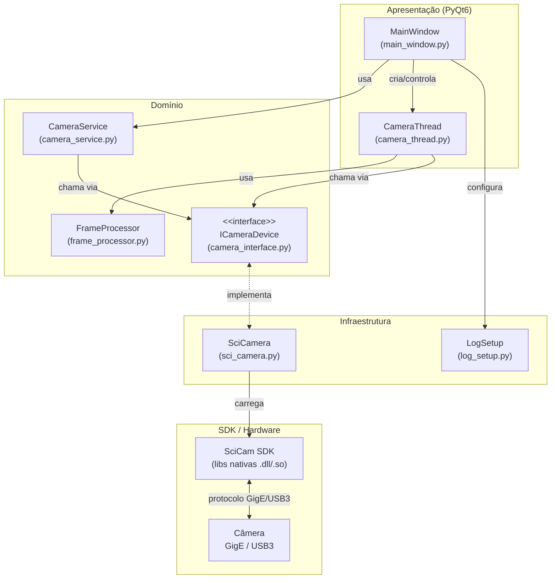
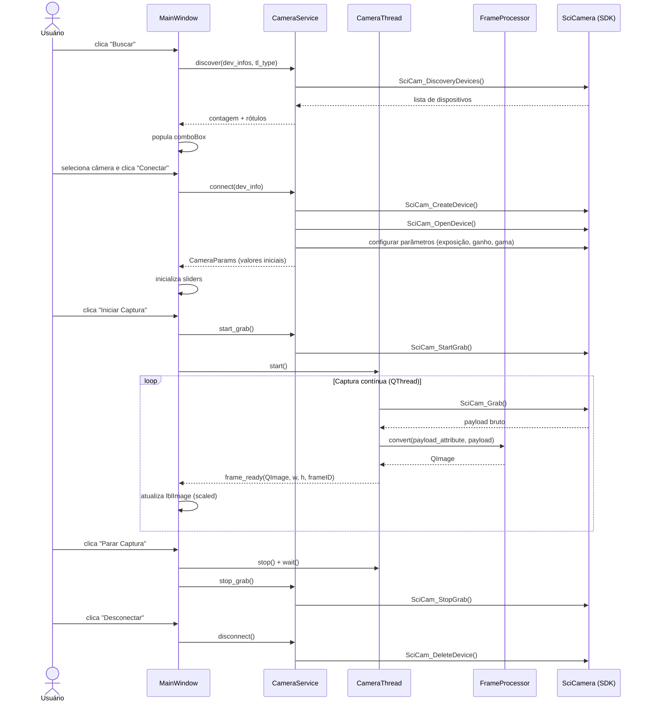
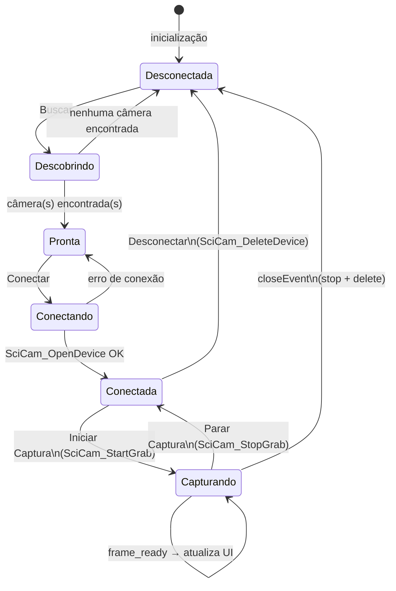

# Captura de Imagens — SciCam

Aplicativo desktop com interface gráfica (PyQt6) para captura e visualização de imagens de câmeras industriais via SDK SciCam. Suporta câmeras GigE e USB3, com controles de exposição, ganho e gama em tempo real.

## Funcionalidades

- Busca e conexão automática de câmeras GigE e USB3
- Visualização de frames ao vivo com escalonamento automático
- Controle de exposição (manual e automática), ganho e gama via sliders
- Registro de logs com rotação automática em `logs/app.log`
- Degradação graciosa quando o SDK não está disponível (modo simulação)

---

## Requisitos

- Python 3.12+
- SDK SciCam instalado (bibliotecas nativas em `libs/`)

---

## Instalação

### Linux

```bash
# 1. Crie e ative o ambiente virtual
python -m venv .venv
source .venv/bin/activate

# 2. Instale as dependências Python
pip install -r requirements.txt
```

### Windows

```bash
# 1. Crie e ative o ambiente virtual
python -m venv .venv
source venv/bin/activate

# 2. Instale as dependências Python
pip install -r requirements.txt
```

---

## Execução

```bash
python main.py
```

> Caso o SDK SciCam não esteja disponível, a aplicação inicializa em **modo simulação** — útil para desenvolvimento e testes da interface.

---

## Editor de Interface

Para editar o layout `interface.ui` visualmente no Qt Designer:

**Linux**
```bash
./.venv/bin/pyside6-designer
```

**Windows**
```bash
./.venv/Lib/site-packages/PySide6/designer.exe
```

---

## Arquitetura

### Camadas da Aplicação



### Fluxo de Captura de Imagens



### Ciclo de Vida da Câmera



---

## Estrutura do Projeto

```
.
├── main.py                         # Ponto de entrada: libs nativas, logging e QApplication
├── requirements.txt                # Dependências Python
├── app/
│   ├── domain/
│   │   ├── frame_processor.py      # Converte payload bruto em QImage (Strategy)
│   │   ├── interfaces/
│   │   │   └── camera_interface.py # Contrato abstrato ICameraDevice
│   │   └── services/
│   │       └── camera_service.py   # Orquestra o ciclo de vida da câmera
│   ├── infrastructure/
│   │   ├── camera/
│   │   │   ├── sci_camera.py       # Implementação concreta via SDK SciCam
│   │   │   ├── sci_cam_errors.py   # Constantes de erro do SDK
│   │   │   ├── sci_cam_info.py     # Estruturas de informação de dispositivo
│   │   │   └── sci_cam_payload.py  # Estruturas e funções de payload/imagem
│   │   └── logging/
│   │       └── log_setup.py        # Configuração de logging com rotação
│   └── presentation/
│       ├── camera_thread.py        # QThread para captura em segundo plano
│       ├── main_window.py          # Janela principal (conecta UI ↔ domínio)
│       └── main_window.ui          # Layout Qt Designer
├── libs/                           # Bibliotecas nativas do SDK (CTI, SO/DLL)
├── samples/                        # Demos e módulos Python do SDK SciCam
├── logs/                           # Logs da aplicação (gerados em tempo de execução)
├── System/Config/                  # Configurações do driver (OptDriverSet.ini)
└── SystemLog/                      # Logs gerados pelo driver da câmera
```

---

## Dependências Python

| Pacote | Versão |
|---|---|
| numpy | 2.4.4 |
| opencv-python | 4.13.0.92 |
| PyQt6 | 6.11.0 |
| PyQt6-Qt6 | 6.11.0 |
| PyQt6_sip | 13.11.1 |
| psutil | latest |
